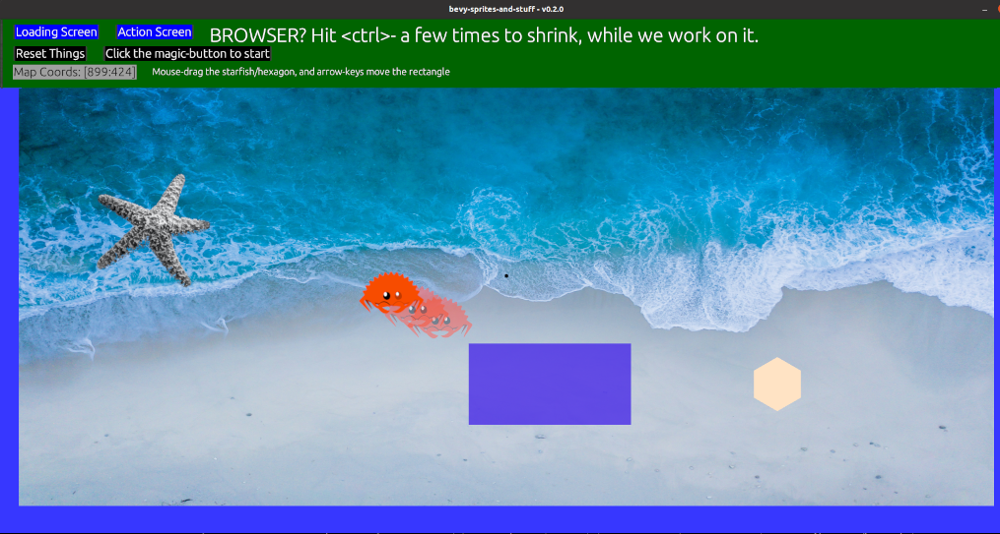

### bevy-sprites-and-stuff

This is basically a simple demonstration of the Bevy game-engine, using a variety of
basic techniques and concepts. Such as...

 - loading/changing backgrounds from a file
 - loading sprites from a file (some with spritemaps)
 - constructing sprites from Materials or Polygon Meshes
 - moving sprites automatically
 - mouse/keyboard inputs
   - spacebar pauses game/changes background
   - moving sprites via the arrow-keys
   - mouse-dragging a sprite, mostly working
 - assorted ECS concepts
 - assorted Rust concepts
 - lerping, whatever that means

Nothing especially profound, just things that I have done as part of
learning Bevy, while moving towards making an actual game with it.

### TODO
 - currently, the mouse can out-run the sprite, worth fixing?
 - maybe make the water-part of the beach, translucent?
 - add a rotation to the Crab, now that it's not just moving on the X-axis

### Requirements
 - Rust 1.60+
 - Bevy 0.8.0

### To Run
You don't have to use `release`, but a `debug` compile, takes a few seconds
longer to load the background bitmap.

    cargo run --release

### Output

